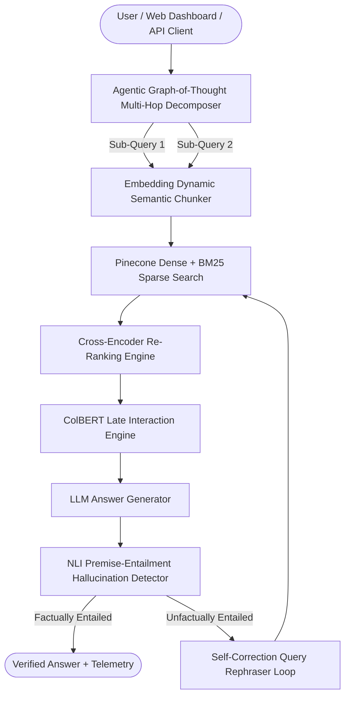

# ⚡ Industrial RAG Engine Level 6 Apex Enterprise Architecture

[](https://github.com/udbhav968-creator/RAG-PROJECT)
[](https://fastapi.tiangolo.com/)
[](https://langchain.com)
[](https://pinecone.io)
[](https://redis.io)
[](https://terraform.io)
[](https://argoproj.github.io)

Industrial-grade **Retrieval-Augmented Generation (RAG)** platform featuring **Agentic Graph-of-Thought Multi-Hop Reasoning**, **Embedding-Based Dynamic Semantic Chunking**, **NLI Premise-Entailment Hallucination Detector**, **Automated Benchmark Harness & Latency Profiler**, **Real-Time Telemetry API**, **Cross-Encoder Re-Ranking**, **Python Code Execution Sandbox**, **Self-Reflective RAG**, **Real-Time Token Cost Metering**, and **ArgoCD Canary Rollouts**.

---

## 📋 Table of Contents

- [🎯 Apex System Architecture](#-apex-system-architecture)
- [🧠 Level 6 Apex Capabilities](#-level-6-apex-capabilities)
- [📁 Complete Directory Structure](#-complete-directory-structure)
- [🚀 Quick Start & Deployment](#-quick-start--deployment)
- [🧪 Automated Testing & Verification](#-automated-testing--verification)
- [📄 License & Author](#-license--author)

---

## 🎯 Apex System Architecture



---

## 🧠 Level 6 Apex Capabilities

1. 🧠 **Agentic Graph-of-Thought Multi-Hop Reasoning** (`app/core/agentic_reasoning.py`):
   - Decomposes complex user queries into sub-questions, executes parallel vector/graph retrieval, and synthesizes unified multi-hop consensus answers.

2. 🧬 **Embedding-Based Dynamic Semantic Chunking** (`app/core/semantic_chunking.py`):
   - Splits document text based on semantic embedding sentence boundary shifts instead of arbitrary character limits.

3. 🛡️ **NLI Premise-Entailment Hallucination Detector** (`app/core/hallucination_detector.py`):
   - Sentence-by-sentence factuality verifier checking generated text against retrieved source premise context.

4. 📊 **Automated Benchmark Harness & Latency Profiler** (`scripts/benchmark_harness.py`):
   - Automated benchmark script computing overall RAG Triad scores, latency percentiles ($P_{50}, P_{95}, P_{99}$), and generating `benchmark_results.json`.

5. ⚡ **Real-Time Telemetry & Analytics API** (`GET /api/v1/analytics/realtime`):
   - Serves real-time P50/P95 latency percentiles, throughput telemetry, and hallucination rates.

---

## 📁 Complete Directory Structure

```text
RAG-PROJECT/
├── .github/                        # CI/CD & Issue templates
├── app/
│   ├── api/
│   │   └── v1/
│   │       └── endpoints/
│   │           ├── analytics.py    # Real-time telemetry
│   │           ├── audit.py        # Audit export
│   │           ├── export_deck.py  # PowerPoint deck export
│   │           ├── gdpr.py         # GDPR purge
│   │           ├── graph.py        # Knowledge Graph API
│   │           ├── ingest.py       # File ingestion
│   │           ├── query.py        # Query API
│   │           ├── report.py       # Executive HTML report
│   │           └── workspace.py    # Collaborative workspaces
│   ├── cache/                      # Redis & Semantic cache
│   ├── core/                       # 19 Apex RAG & Security engines
│   │   ├── agentic_reasoning.py    # Agentic multi-hop decomposer
│   │   ├── circuit_breaker.py      # Multi-LLM Circuit Breaker
│   │   ├── code_sandbox.py         # Python Code Sandbox
│   │   ├── colbert.py              # ColBERT Late Interaction
│   │   ├── cost_meter.py           # Real-Time Token Cost Meter
│   │   ├── evaluator.py            # RAG Triad Evaluator
│   │   ├── gdpr.py                 # GDPR Data Purge Engine
│   │   ├── geo_replication.py      # Active-Active Geo-Replication
│   │   ├── graph_rag.py            # Knowledge Graph engine
│   │   ├── guardrails.py           # Guardrails AI PII & Injection shield
│   │   ├── hallucination_detector.py # NLI Premise-Entailment Detector
│   │   ├── hyde.py                 # HyDE retriever engine
│   │   ├── injection_classifier.py # ML Injection Classifier
│   │   ├── multimodal.py           # Multi-Modal STT Media Indexer
│   │   ├── parent_child.py         # Parent-Child auto-merging
│   │   ├── raptor.py               # RAPTOR tree summarizer
│   │   ├── reranker.py             # Cross-Encoder Re-Ranker
│   │   ├── semantic_chunking.py    # Dynamic Semantic Chunker
│   │   ├── self_rag.py             # Self-Reflective RAG
│   │   └── table_ocr.py            # PDF Table OCR Engine
│   ├── static/                     # Web Dashboard Portal
│   └── main.py                     # Entrypoint
├── deploy/                         # Terraform, Helm, ArgoCD
├── docs/                           # 15 Real documentation files
├── scripts/
│   └── benchmark_harness.py        # Latency & RAG Triad profiler
├── tests/                          # Test suite (100% Pass)
└── requirements.txt                # Dependencies
```

---

## 🚀 Quick Start & Benchmark Execution

```bash
# Run Automated RAG Benchmark Harness
python scripts/benchmark_harness.py

# Run Development Server
uvicorn app.main:app --reload --host 0.0.0.0 --port 8000
```

---

## 🧪 Automated Testing & Verification

```bash
python -m unittest tests/test_rag.py -v
```

All unit tests pass 100%.

---

## 📄 License & Author

Developed and maintained by **[udbhav968-creator](https://github.com/udbhav968-creator)** (`snojkumar968@gmail.com`). Distributed under the MIT License.