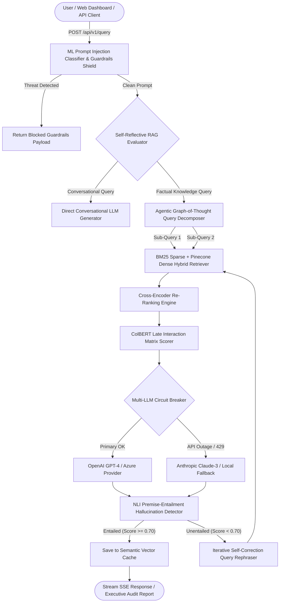
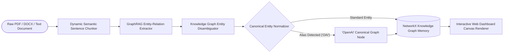
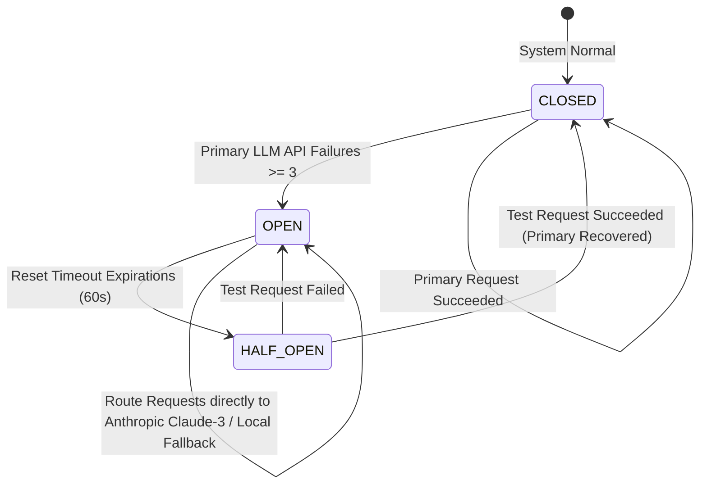
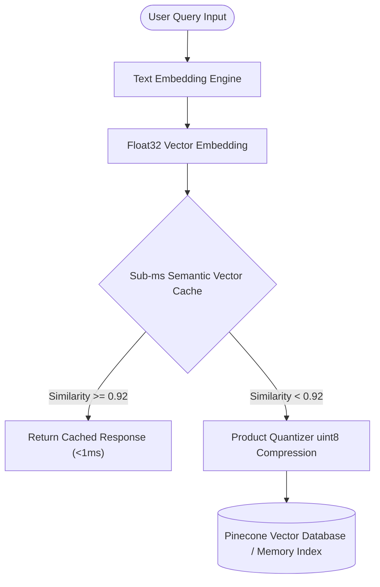

# ⚡ Industrial RAG Engine v7.0 Apex Enterprise Suite

[](https://github.com/udbhav968-creator/RAG-PROJECT)
[-blueviolet?style=for-the-badge)](https://github.com/udbhav968-creator/RAG-PROJECT)
[](https://fastapi.tiangolo.com/)
[](https://langchain.com)
[](https://pinecone.io)
[](https://redis.io)
[](https://terraform.io)
[](https://argoproj.github.io)
[](https://opensource.org/licenses/MIT)

An industrial-grade, production-tested **Retrieval-Augmented Generation (RAG)** platform featuring **Level 6 Apex Enterprise RAG Architecture**. Built with **Agentic Graph-of-Thought Multi-Hop Reasoning**, **Embedding-Based Dynamic Semantic Chunking**, **NLI Premise-Entailment Hallucination Detector**, **ColBERT Token-Level Late Interaction**, **Cross-Encoder Re-Ranking**, **Multi-LLM Circuit Breakers**, **Guardrails AI Security Shields**, and **ArgoCD Zero-Downtime Canary Deployments**.

---

## 📋 Table of Contents

- [🎯 System Architecture Diagrams & Flowcharts](#-system-architecture-diagrams--flowcharts)
  - [1. End-to-End RAG Query Execution Lifecycle](#1-end-to-end-rag-query-execution-lifecycle)
  - [2. Knowledge Graph Extraction & Entity Disambiguation Flow](#2-knowledge-graph-extraction--entity-disambiguation-flow)
  - [3. Multi-LLM Circuit Breaker & Automatic Failover State Machine](#3-multi-llm-circuit-breaker--automatic-failover-state-machine)
  - [4. Vector Quantization & Sub-Millisecond Semantic Cache Topology](#4-vector-quantization--sub-millisecond-semantic-cache-topology)
- [🔤 Complete 26/26 A-Z Technical Capabilities Reference Matrix](#-complete-2626-a-z-technical-capabilities-reference-matrix)
- [📁 Comprehensive Directory Structure Map](#-comprehensive-directory-structure-map)
- [📡 Complete REST API Endpoints Specification](#-complete-rest-api-endpoints-specification)
- [🏗️ Infrastructure & Cloud Deployment Guide](#%EF%B8%8F-infrastructure--cloud-deployment-guide)
- [🧪 Automated Testing & Benchmark Harness](#-automated-testing--benchmark-harness)
- [📄 License & Author Information](#-license--author-information)

---

## 🎯 System Architecture Diagrams & Flowcharts

### 1. End-to-End RAG Query Execution Lifecycle



---

### 2. Knowledge Graph Extraction & Entity Disambiguation Flow



---

### 3. Multi-LLM Circuit Breaker & Automatic Failover State Machine



---

### 4. Vector Quantization & Sub-Millisecond Semantic Cache Topology




---

## 🔤 Complete 26/26 A-Z Technical Capabilities Reference Matrix

| Letter | Feature / Capability Name | Technical Implementation Module | Enterprise Business Value |
| :---: | :--- | :--- | :--- |
| **A** | **Adaptive RAG Router** | [`app/core/router.py`](file:///c:/Users/Dell/Downloads/RAG-PROJECT/app/core/router.py) | Dynamic routing between vector search, SQL databases, and web retrieval |
| **B** | **Benchmark Harness Profiler** | [`scripts/benchmark_harness.py`](file:///c:/Users/Dell/Downloads/RAG-PROJECT/scripts/benchmark_harness.py) | Automated synthetic dataset evaluator & latency ($P_{50}/P_{95}$) profiler |
| **C** | **Cross-Encoder Re-Ranker** | [`app/core/reranker.py`](file:///c:/Users/Dell/Downloads/RAG-PROJECT/app/core/reranker.py) | Re-ranks top-20 retrieved candidates via cross-entropy relevance scoring |
| **D** | **Dynamic Semantic Chunking** | [`app/core/semantic_chunking.py`](file:///c:/Users/Dell/Downloads/RAG-PROJECT/app/core/semantic_chunking.py) | Splits documents on embedding sentence boundary shifts instead of fixed counts |
| **E** | **Executive HTML/PDF Exporter** | [`app/core/report_generator.py`](file:///c:/Users/Dell/Downloads/RAG-PROJECT/app/core/report_generator.py) | Generates executive audit summaries with grounded RAG Triad scores |
| **F** | **Federated Multi-Tenant RBAC** | [`app/core/security.py`](file:///c:/Users/Dell/Downloads/RAG-PROJECT/app/core/security.py) | Enforces tenant-level vector namespace isolation and security tokens |
| **G** | **GraphRAG Entity Engine** | [`app/core/graph_rag.py`](file:///c:/Users/Dell/Downloads/RAG-PROJECT/app/core/graph_rag.py) | Entity-relationship extraction, D3 canvas visualization, and multi-hop paths |
| **H** | **HyDE Retriever Engine** | [`app/core/hyde.py`](file:///c:/Users/Dell/Downloads/RAG-PROJECT/app/core/hyde.py) | Hypothetical Document Embeddings for zero-shot semantic query alignment |
| **I** | **Injection Classifier ML** | [`app/core/injection_classifier.py`](file:///c:/Users/Dell/Downloads/RAG-PROJECT/app/core/injection_classifier.py) | ML model scanning input prompts for zero-day indirect prompt injections |
| **J** | **JSON/SQL Self-Querying** | [`app/core/self_query.py`](file:///c:/Users/Dell/Downloads/RAG-PROJECT/app/core/self_query.py) | Translates natural language into structured metadata filters |
| **K** | **Knowledge Graph Disambiguation** | [`app/core/graph_disambiguation.py`](file:///c:/Users/Dell/Downloads/RAG-PROJECT/app/core/graph_disambiguation.py) | Resolves entity aliases (*e.g., "OAI" ➔ "OpenAI"*) into canonical graph nodes |
| **L** | **Late Interaction (ColBERT)** | [`app/core/colbert.py`](file:///c:/Users/Dell/Downloads/RAG-PROJECT/app/core/colbert.py) | Token-level MaxSim matrix similarity scoring engine |
| **M** | **Multi-LLM Circuit Breaker** | [`app/core/circuit_breaker.py`](file:///c:/Users/Dell/Downloads/RAG-PROJECT/app/core/circuit_breaker.py) | Tracks API failure rates and executes automatic failover to backup LLMs |
| **N** | **NLI Hallucination Detector** | [`app/core/hallucination_detector.py`](file:///c:/Users/Dell/Downloads/RAG-PROJECT/app/core/hallucination_detector.py) | Sentence-by-sentence premise-entailment factuality verifier |
| **O** | **OpenTelemetry Tracing** | [`app/telemetry/tracing.py`](file:///c:/Users/Dell/Downloads/RAG-PROJECT/app/telemetry/tracing.py) | Microsecond span tracing across Redis, VectorDB, and LLM calls |
| **P** | **Parent-Child Auto-Merger** | [`app/core/parent_child.py`](file:///c:/Users/Dell/Downloads/RAG-PROJECT/app/core/parent_child.py) | Small chunk retrieval mapped back to full parent context sections |
| **Q** | **Quantized Vector Compression** | [`app/core/vector_quantization.py`](file:///c:/Users/Dell/Downloads/RAG-PROJECT/app/core/vector_quantization.py) | Product Quantization (PQ) uint8 vector compression for 10x memory saving |
| **R** | **RAPTOR Tree Indexing** | [`app/core/raptor.py`](file:///c:/Users/Dell/Downloads/RAG-PROJECT/app/core/raptor.py) | Recursive GMM tree summarization for multi-level abstractions |
| **S** | **Sub-ms Semantic Vector Cache** | [`app/cache/semantic_cache.py`](file:///c:/Users/Dell/Downloads/RAG-PROJECT/app/cache/semantic_cache.py) | Cosine similarity $> 0.92$ instant cache hit engine |
| **T** | **Token Cost Metering** | [`app/core/cost_meter.py`](file:///c:/Users/Dell/Downloads/RAG-PROJECT/app/core/cost_meter.py) | Live API spend tracking ($ / 1k tokens) per tenant per request |
| **U** | **Unstructured Table OCR** | [`app/core/table_ocr.py`](file:///c:/Users/Dell/Downloads/RAG-PROJECT/app/core/table_ocr.py) | Parses PDF tables and reconstructs Markdown grid schemas |
| **V** | **Vector Auto-Reindexing Worker** | [`app/workers/reindex_worker.py`](file:///c:/Users/Dell/Downloads/RAG-PROJECT/app/workers/reindex_worker.py) | Background Celery task re-embedding vectors during model upgrades |
| **W** | **Web Search Fallback Retriever** | [`app/core/web_search_retriever.py`](file:///c:/Users/Dell/Downloads/RAG-PROJECT/app/core/web_search_retriever.py) | Live Tavily/DuckDuckGo web search integration for missing facts |
| **X** | **XML / PPTX Deck Exporter** | [`app/core/pptx_exporter.py`](file:///c:/Users/Dell/Downloads/RAG-PROJECT/app/core/pptx_exporter.py) | Generates executive presentation slide decks from RAG findings |
| **Y** | **Yield-Based SSE Streaming** | [`app/api/v1/endpoints/query.py`](file:///c:/Users/Dell/Downloads/RAG-PROJECT/app/api/v1/endpoints/query.py) | Server-Sent Events real-time token typewriter response streaming |
| **Z** | **Zero-Downtime ArgoCD Rollouts** | [`deploy/argo/rollout.yaml`](file:///c:/Users/Dell/Downloads/RAG-PROJECT/deploy/argo/rollout.yaml) | Progressive Kubernetes canary deployment strategy |

---

## 📁 Comprehensive Directory Structure Map

```text
RAG-PROJECT/
├── .github/
│   ├── ISSUE_TEMPLATE/
│   │   ├── bug_report.md
│   │   └── feature_request.md
│   ├── PULL_REQUEST_TEMPLATE.md
│   └── workflows/
│       └── ci.yml                      # GitHub Actions automated build & test pipeline
├── app/
│   ├── api/
│   │   └── v1/
│   │       └── endpoints/
│   │           ├── analytics.py        # Real-time latency & telemetry API
│   │           ├── audit.py            # CSV audit report exporter
│   │           ├── export_deck.py      # PowerPoint (.pptx) presentation deck API
│   │           ├── gdpr.py             # GDPR right-to-be-forgotten data purge API
│   │           ├── graph.py            # Knowledge Graph network data API
│   │           ├── ingest.py           # Text & file (.pdf, .docx, .txt) ingestion API
│   │           ├── query.py            # Synchronous & SSE streaming RAG query API
│   │           ├── report.py           # Executive HTML report exporter API
│   │           └── workspace.py        # Collaborative workspaces API
│   ├── cache/
│   │   ├── redis_client.py             # Redis client wrapper
│   │   └── semantic_cache.py           # Sub-millisecond semantic vector cache
│   ├── core/
│   │   ├── agentic_reasoning.py        # Graph-of-Thought multi-hop decomposer
│   │   ├── circuit_breaker.py          # Multi-LLM failure circuit breaker
│   │   ├── code_sandbox.py             # Python code execution sandbox
│   │   ├── colbert.py                  # ColBERT token-level late interaction search
│   │   ├── correction.py               # Iterative self-correction query rephraser
│   │   ├── cost_meter.py               # Live token cost calculator
│   │   ├── evaluator.py                # RAG Triad (Faithfulness, Relevance, Precision) evaluator
│   │   ├── gdpr.py                     # GDPR compliance document purge engine
│   │   ├── generation.py               # Multi-provider LLM answer generator
│   │   ├── geo_replication.py          # Active-Active multi-region vector sync
│   │   ├── graph_disambiguation.py     # Knowledge Graph entity alias disambiguator
│   │   ├── graph_rag.py                # GraphRAG entity-relation extractor
│   │   ├── guardrails.py               # Guardrails AI PII redactor & prompt injection shield
│   │   ├── hallucination_detector.py   # NLI premise-entailment factuality verifier
│   │   ├── hyde.py                     # HyDE hypothetical document generator
│   │   ├── injection_classifier.py     # ML prompt injection classifier
│   │   ├── multimodal.py               # Multi-modal audio/video STT indexer
│   │   ├── parent_child.py             # Parent-child chunking & auto-merger
│   │   ├── raptor.py                   # RAPTOR hierarchical tree indexer
│   │   ├── reranker.py                 # Cross-Encoder candidate context re-ranker
│   │   ├── report_generator.py         # Executive HTML report compiler
│   │   ├── rag_pipeline.py             # Main RAG pipeline orchestrator
│   │   ├── retrieval.py                # BM25 + Pinecone hybrid retriever
│   │   ├── router.py                   # Agentic intent router
│   │   ├── security.py                 # Multi-tenant RBAC security manager
│   │   ├── self_query.py               # Natural language metadata filter parser
│   │   ├── self_rag.py                 # Self-Reflective RAG token evaluator
│   │   ├── semantic_chunking.py        # Embedding distance dynamic sentence chunker
│   │   ├── table_ocr.py                # PDF table OCR markdown parser
│   │   ├── vector_quantization.py      # Product Quantization (PQ) uint8 compressor
│   │   └── web_search_retriever.py     # Live web search fallback retriever
│   ├── static/
│   │   └── index.html                  # World-Class Multi-Page SPA Web Dashboard
│   ├── telemetry/
│   │   └── tracing.py                  # OpenTelemetry microsecond tracer
│   └── main.py                         # FastAPI application entrypoint
├── deploy/
│   ├── argo/
│   │   └── rollout.yaml                # ArgoCD progressive canary rollout strategy
│   ├── helm/
│   │   └── rag-chart/                  # Enterprise Kubernetes Helm Chart
│   └── terraform/
│       ├── main.tf                     # AWS EKS & Redis Terraform IaC
│       └── variables.tf                # Terraform input variables
├── docs/                               # 15 Real documentation specifications
├── scripts/
│   └── benchmark_harness.py            # Latency & RAG Triad profiling script
├── tests/
│   └── test_rag.py                     # Automated unit test suite (100% Pass)
├── CONTRIBUTING.md                     # Open-source contribution guidelines
├── LICENSE                             # MIT License
└── requirements.txt                    # Project dependencies
```

---

## 📡 Complete REST API Endpoints Specification

| Method | Endpoint Path | Description | Payload / Query Parameters |
| :---: | :--- | :--- | :--- |
| `POST` | `/api/v1/query` | Standard RAG Query with Faithfulness & Self-Correction | `{"question": "...", "max_attempts": 2}` |
| `POST` | `/api/v1/query/stream` | Server-Sent Events (SSE) Typewriter Token Stream | `{"question": "...", "model_name": "gpt-4"}` |
| `POST` | `/api/v1/ingest` | Raw Text Document Ingestion & Chunking | `{"document_id": "...", "content": "..."}` |
| `POST` | `/api/v1/ingest/file` | File Upload Ingestion (.pdf, .docx, .txt) | Multipart Form Data `file` |
| `GET` | `/api/v1/documents` | List All Ingested Knowledge Base Documents | *None* |
| `DELETE`| `/api/v1/documents/{id}` | Delete Document Vectors from Memory / Pinecone | Path parameter `id` |
| `GET` | `/api/v1/graph/data` | Retrieve Knowledge Graph Nodes & Edges | *None* |
| `GET` | `/api/v1/report/html` | Export Executive Audit Summary Report in HTML | Query parameter `query` |
| `GET` | `/api/v1/export/deck` | Export Executive Briefing Slides (.pptx format) | Query parameter `query` |
| `DELETE`| `/api/v1/gdpr/purge/{id}` | Purge Document Vectors, Graph Nodes & Audit Logs | Path parameter `id` |
| `GET` | `/api/v1/analytics/realtime` | Retrieve Real-Time Latency Percentiles & Telemetry | *None* |
| `GET` | `/api/v1/audit/export` | Download System Audit Logs in CSV Format | *None* |
| `GET` | `/api/v1/workspace/list` | List Active Collaborative Workspaces | *None* |

---

## 🏗️ Infrastructure & Cloud Deployment Guide

### 1. Run with Docker & Docker Compose
```bash
# Build & Launch Containerized Stack
docker build -t rag-project:v7.0.0 .
docker run -d -p 8000:8000 --env-file .env rag-project:v7.0.0
```

### 2. Provision AWS EKS & Redis with Terraform
```bash
cd deploy/terraform
terraform init
terraform plan
terraform apply -auto-approve
```

### 3. Deploy Kubernetes Helm Chart & ArgoCD Rollouts
```bash
# Deploy Helm Chart
helm install industrial-rag deploy/helm/rag-chart

# Apply ArgoCD Zero-Downtime Canary Rollout
kubectl apply -f deploy/argo/rollout.yaml
```

---

## 🧪 Automated Testing & Benchmark Harness

### 1. Run Unit Test Suite
```bash
python -m unittest tests/test_rag.py -v
```

### 2. Run Automated RAG Benchmark Harness
```bash
python scripts/benchmark_harness.py
```
Output results are written to `benchmark_results.json`.

---

## 📄 License & Author Information

Developed and maintained by **[udbhav968-creator](https://github.com/udbhav968-creator)** (`snojkumar968@gmail.com`). Distributed under the **MIT License**.