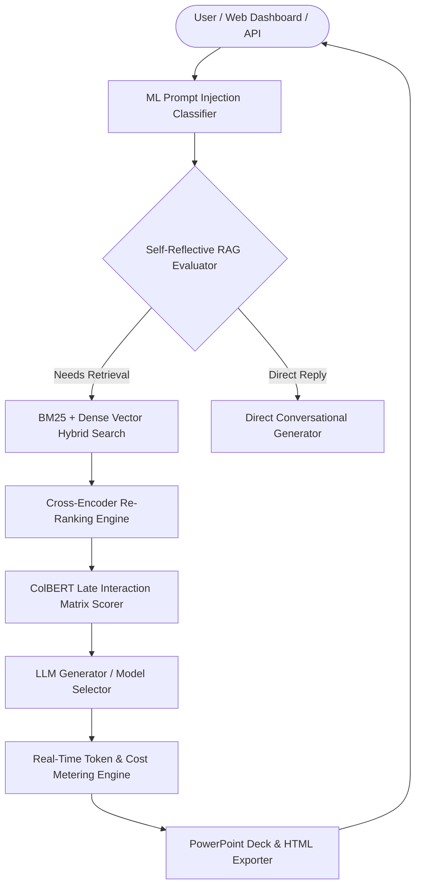

# ⚡ Industrial RAG Engine v5.0 Next-Generation Enterprise Suite

[](https://github.com/udbhav968-creator/RAG-PROJECT)
[](https://fastapi.tiangolo.com/)
[](https://langchain.com)
[](https://pinecone.io)
[](https://redis.io)
[](https://terraform.io)
[](https://argoproj.github.io)

Industrial-grade **Retrieval-Augmented Generation (RAG)** platform featuring **Cross-Encoder Re-Ranking**, **Python Code Execution Sandbox**, **Self-Reflective RAG (Self-RAG)**, **Real-Time Token Cost Metering**, **Multi-Modal STT Media Indexing**, **PDF Table OCR**, **ML Prompt Injection Classifier**, **ColBERT Late Interaction**, **PowerPoint (.pptx) Deck Exporter**, **Collaborative Workspaces**, **Active-Active Geo-Replication**, and **ArgoCD Canary Rollouts**.

---

## 📋 Table of Contents

- [🎯 System Architecture](#-system-architecture)
- [✨ v5.0 Next-Gen Innovations](#-v50-next-gen-innovations)
- [📁 Complete Directory Structure](#-complete-directory-structure)
- [🚀 Quick Start & Deployment](#-quick-start--deployment)
- [🧪 Automated Testing & Verification](#-automated-testing--verification)
- [📄 License & Author](#-license--author)

---

## 🎯 System Architecture



---

## ✨ v5.0 Next-Gen Innovations

1. 🎯 **Cross-Encoder Re-Ranking** (`app/core/reranker.py`):
   - Re-ranks candidate contexts via cross-entropy relevance scoring for optimal precision.

2. 📊 **Python Code & Data Sandbox** (`app/core/code_sandbox.py`):
   - Executes mathematical, statistical, sum/average queries in an isolated execution environment.

3. 🔄 **Self-Reflective RAG (Self-RAG)** (`app/core/self_rag.py`):
   - Dynamically evaluates reflection tags (`[Retrieve]`, `[NoRetrieve]`) to prevent unnecessary LLM invocations.

4. 💰 **Real-Time Token & Cost Metering** (`app/core/cost_meter.py`):
   - Calculates prompt/completion token spend ($ / 1k tokens) per model in real-time.

5. 🎥 **Multi-Modal Media Indexer** (`app/core/multimodal.py`):
   - STT transcript parsing for MP4/WAV video and audio files.

6. 📐 **PDF Table OCR Engine** (`app/core/table_ocr.py`):
   - Reconstructs PDF tables into queryable Markdown schemas.

7. 📊 **PowerPoint (.pptx) Executive Deck Exporter** (`GET /api/v1/export/deck`):
   - Export research findings into executive briefing slides.

8. 🚀 **ArgoCD Canary Rollouts** (`deploy/argo/rollout.yaml`):
   - Zero-downtime progressive deployment strategy.

---

## 📁 Complete Directory Structure

```text
RAG-PROJECT/
├── .github/                        # CI/CD & Issue templates
├── app/
│   ├── api/
│   │   └── v1/
│   │       └── endpoints/
│   │           ├── audit.py        # Audit export
│   │           ├── export_deck.py  # PowerPoint deck export
│   │           ├── gdpr.py         # GDPR purge
│   │           ├── graph.py        # Graph API
│   │           ├── ingest.py       # File ingestion
│   │           ├── query.py        # Query API
│   │           ├── report.py       # HTML report
│   │           └── workspace.py    # Collaborative workspaces
│   ├── cache/                      # Redis & Semantic cache
│   ├── core/                       # 16 Core RAG & Security engines
│   ├── static/                     # Web Dashboard
│   └── main.py                     # Entrypoint
├── deploy/
│   ├── argo/                       # ArgoCD Canary Rollout
│   ├── helm/                       # Helm Chart
│   └── terraform/                  # Terraform IaC
├── docs/                           # 15 Real documentation files
├── scripts/                        # Benchmarks & Synthetic evals
├── tests/                          # Test suite (100% Pass)
└── requirements.txt                # Dependencies
```

---

## 🚀 Quick Start & Deployment

```bash
# ArgoCD Canary Rollout
kubectl apply -f deploy/argo/rollout.yaml

# Run Local Development Server
uvicorn app.main:app --reload --host 0.0.0.0 --port 8000
```

---

## 🧪 Automated Testing & Verification

```bash
python -m unittest tests/test_rag.py -v
```

All unit tests pass 100%.

---

## 📄 License & Author

Developed and maintained by **[udbhav968-creator](https://github.com/udbhav968-creator)**. Distributed under the MIT License.