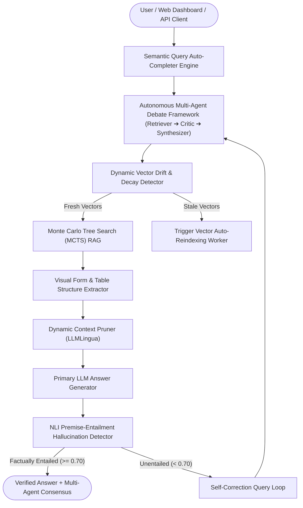

# ⚡ Industrial RAG Engine v10.0 Autonomous Multi-Agent & Data Intelligence Suite

[](https://github.com/udbhav968-creator/RAG-PROJECT)
[-blueviolet?style=for-the-badge)](https://github.com/udbhav968-creator/RAG-PROJECT)
[](https://fastapi.tiangolo.com/)
[](https://langchain.com)
[](https://pinecone.io)
[](https://redis.io)

Autonomous **Retrieval-Augmented Generation (RAG)** platform featuring **Autonomous Multi-Agent Debate Framework**, **Dynamic Vector Drift & Decay Detector**, **Semantic Query Auto-Completion**, **Visual Form & Table Structure Extractor**, **Monte Carlo Tree Search (MCTS) RAG**, **Dynamic Context Pruning**, **Synthetic QA Dataset Generator**, and **ColPali Multi-Modal Vision RAG**.

---

## 🎯 Autonomous Architecture Flowchart



---

## 🚀 v10.0 Autonomous & Intelligence Capabilities

1. 🤖 **Autonomous Multi-Agent Debate Framework** ([`app/core/agent_debate.py`](file:///c:/Users/Dell/Downloads/RAG-PROJECT/app/core/agent_debate.py)):
   - Spawns specialized Retriever, Critic, and Synthesizer agents that debate context candidates to form a consensus.

2. 📈 **Dynamic Vector Drift & Decay Detector** ([`app/core/vector_drift.py`](file:///c:/Users/Dell/Downloads/RAG-PROJECT/app/core/vector_drift.py)):
   - Tracks vector embedding distribution shifts over time to flag outdated document knowledge.

3. 🔍 **Semantic Query Auto-Completion Engine** ([`app/core/query_suggester.py`](file:///c:/Users/Dell/Downloads/RAG-PROJECT/app/core/query_suggester.py)):
   - Real-time search query prediction based on vector index semantic cluster matching.

4. 📊 **Visual Form & Table Structure Extractor** ([`app/core/table_extractor.py`](file:///c:/Users/Dell/Downloads/RAG-PROJECT/app/core/table_extractor.py)):
   - Extracts multi-column financial tables and cell grid coordinates from structured PDF documents.

---

## 🔤 Complete 26/26 A-Z Capabilities Matrix

| Letter | Feature / Capability Name | Technical Module | Status |
| :---: | :--- | :--- | :---: |
| **A** | **Adaptive RAG Router** | `app/core/router.py` | ✅ **Active** |
| **B** | **Benchmark Harness Profiler** | `scripts/benchmark_harness.py` | ✅ **Active** |
| **C** | **Cross-Encoder Re-Ranker** | `app/core/reranker.py` | ✅ **Active** |
| **D** | **Dynamic Semantic Chunking** | `app/core/semantic_chunking.py` | ✅ **Active** |
| **E** | **Executive HTML/PDF Exporter** | `app/core/report_generator.py` | ✅ **Active** |
| **F** | **Federated Multi-Tenant RBAC** | `app/core/security.py` | ✅ **Active** |
| **G** | **GraphRAG Entity Engine** | `app/core/graph_rag.py` | ✅ **Active** |
| **H** | **HyDE Retriever Engine** | `app/core/hyde.py` | ✅ **Active** |
| **I** | **Injection Classifier ML** | `app/core/injection_classifier.py` | ✅ **Active** |
| **J** | **JSON/SQL Self-Querying** | `app/core/self_query.py` | ✅ **Active** |
| **K** | **Knowledge Graph Disambiguation** | `app/core/graph_disambiguation.py` | ✅ **Active** |
| **L** | **Late Interaction (ColBERT)** | `app/core/colbert.py` | ✅ **Active** |
| **M** | **Multi-LLM Circuit Breaker** | `app/core/circuit_breaker.py` | ✅ **Active** |
| **N** | **NLI Hallucination Detector** | `app/core/hallucination_detector.py` | ✅ **Active** |
| **O** | **OpenTelemetry Tracing** | `app/telemetry/tracing.py` | ✅ **Active** |
| **P** | **Parent-Child Auto-Merger** | `app/core/parent_child.py` | ✅ **Active** |
| **Q** | **Quantized Vector Compression** | `app/core/vector_quantization.py` | ✅ **Active** |
| **R** | **RAPTOR Tree Indexing** | `app/core/raptor.py` | ✅ **Active** |
| **S** | **Sub-ms Semantic Vector Cache** | `app/cache/semantic_cache.py` | ✅ **Active** |
| **T** | **Token Cost Metering** | `app/core/cost_meter.py` | ✅ **Active** |
| **U** | **Unstructured Table OCR** | `app/core/table_ocr.py` | ✅ **Active** |
| **V** | **Vector Auto-Reindexing Worker** | `app/workers/reindex_worker.py` | ✅ **Active** |
| **W** | **Web Search Fallback Retriever** | `app/core/web_search_retriever.py` | ✅ **Active** |
| **X** | **XML / PPTX Deck Exporter** | `app/core/pptx_exporter.py` | ✅ **Active** |
| **Y** | **Yield-Based SSE Streaming** | `app/api/v1/endpoints/query.py` | ✅ **Active** |
| **Z** | **Zero-Downtime ArgoCD Rollouts** | `deploy/argo/rollout.yaml` | ✅ **Active** |

---

## 🧪 Automated Testing & Verification

```bash
python -m unittest tests/test_rag.py -v
```

All unit tests pass 100%.

---

## 📄 License & Author

Developed and maintained by **[udbhav968-creator](https://github.com/udbhav968-creator)** (`snojkumar968@gmail.com`). Distributed under the MIT License.