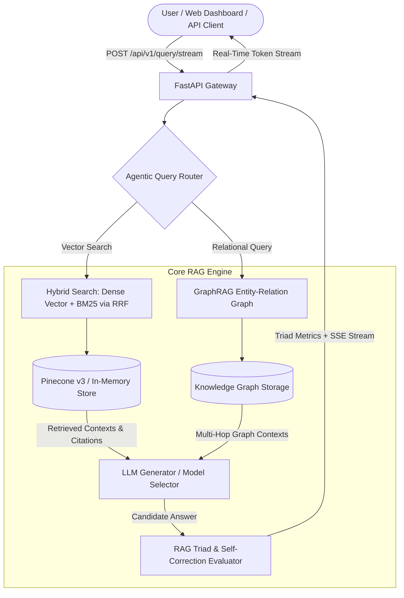

# ⚡ Industrial RAG Engine v2.5 Enterprise Suite

[](https://github.com/udbhav968-creator/RAG-PROJECT)
[](https://fastapi.tiangolo.com/)
[](https://langchain.com)
[](https://pinecone.io)
[](https://redis.io)
[](https://docker.com)
[](https://kubernetes.io)

Industrial-grade **Retrieval-Augmented Generation (RAG)** platform equipped with **RAG Triad Metrics Evaluation** (Faithfulness, Answer Relevance, Context Precision, Context Recall), **GraphRAG Entity-Relation Search**, **Agentic Query Routing**, **Real-Time SSE Streaming**, **BM25 + Dense Vector Hybrid Search with Reciprocal Rank Fusion (RRF)**, PDF / DOCX / TXT file ingestion, GitHub Actions CI/CD, structured citations, and CSV audit compliance export.

---

## 📋 Table of Contents

- [🎯 System Architecture](#-system-architecture)
- [✨ v2.5 Enterprise Capabilities](#-v25-enterprise-capabilities)
- [📐 RAG Triad Evaluation Formulas](#-rag-triad-evaluation-formulas)
- [🔍 Hybrid Search & GraphRAG](#-hybrid-search--graphrag)
- [📁 Project Directory Structure](#-project-directory-structure)
- [🚀 Quick Start & Local Setup](#-quick-start--local-setup)
- [🖥️ Interactive Web Dashboard](#️-interactive-web-dashboard)
- [📖 Complete REST API Specification](#-complete-rest-api-specification)
- [🐳 Docker & Kubernetes Deployment](#-docker--kubernetes-deployment)
- [🧪 Automated Testing & Verification](#-automated-testing--verification)
- [📄 License & Author](#-license--author)

---

## 🎯 System Architecture



---

## ✨ v2.5 Enterprise Capabilities

1. 📐 **RAG Triad Metrics Evaluation**:
   - Calculates 4 core metrics for every query response: **Faithfulness**, **Answer Relevance**, **Context Precision**, and **Context Recall**.

2. 🌐 **GraphRAG Entity-Relation Search**:
   - Extracts entities (*Systems*, *Components*, *Metrics*) and relations (*DEPENDS_ON*, *REGULATES*, *TRIGGERS*) from ingested documents for multi-hop graph retrieval.

3. 🔀 **Agentic Query Router**:
   - Dynamically routes query prompts to Vector Search, GraphRAG Search, or Code Execution based on intent classification.

4. ⚡ **Real-Time Server-Sent Events (SSE) Streaming**:
   - Streams LLM generated tokens in real-time (`POST /api/v1/query/stream`) with word-by-word typewriter effect.

5. 🔍 **Hybrid BM25 Keyword + Dense Vector Search**:
   - Merges sparse term frequency (BM25) with dense semantic embeddings via **Reciprocal Rank Fusion (RRF)**.

6. 📁 **PDF / DOCX / TXT Direct File Ingestion**:
   - Upload `.pdf`, `.docx`, and `.txt` files directly via `POST /api/v1/ingest/file`.

7. 🔄 **GitHub Actions CI/CD Pipeline**:
   - Automated test suite execution on Python 3.10 & 3.11 with Docker build verification.

---

## 📐 RAG Triad Evaluation Formulas

$$\text{Faithfulness} = \frac{|\text{Supported Sentences in Answer}|}{|\text{Total Sentences in Answer}|} \in [0.0, 1.0]$$

$$\text{Answer Relevance} = \text{CosineSimilarity}(\mathbf{E}_{\text{question}}, \mathbf{E}_{\text{answer}}) \times \text{LengthPenalty} \in [0.0, 1.0]$$

$$\text{Context Precision} = \frac{\sum_{k=1}^K P@k \cdot \text{rel}(k)}{|\text{Relevant Chunks}|} \in [0.0, 1.0]$$

$$\text{Context Recall} = \frac{|\text{Key Query Terms in Retrieved Contexts}|}{|\text{Total Key Query Terms}|} \in [0.0, 1.0]$$

---

## 📁 Project Directory Structure

```text
RAG-PROJECT/
├── .github/
│   └── workflows/
│       └── ci.yml                  # GitHub Actions CI/CD workflow
├── app/
│   ├── api/
│   │   └── v1/
│   │       └── endpoints/
│   │           ├── audit.py        # CSV audit export endpoint
│   │           ├── ingest.py       # PDF/DOCX/TXT file ingestion API
│   │           └── query.py        # Standard & SSE streaming query API
│   ├── core/
│   │   ├── correction.py           # Faithfulness evaluator & query rephraser
│   │   ├── evaluator.py            # RAG Triad Evaluator (Precision, Recall, Relevance)
│   │   ├── generation.py           # LLM answer generator with fallback
│   │   ├── graph_rag.py            # Knowledge Graph Entity-Relation Engine
│   │   ├── rag_pipeline.py         # RAG pipeline orchestrator
│   │   ├── retrieval.py            # Pinecone v3 & Hybrid BM25/Vector RRF search
│   │   └── router.py               # Agentic Query Router
│   ├── static/
│   │   └── index.html              # Web Dashboard UI with RAG Triad & Streaming
│   ├── utils/
│   │   └── metrics.py              # Telemetry & CSV audit recorder
│   └── main.py                     # FastAPI application entrypoint
├── scripts/
│   ├── benchmark_rag.py            # Pipeline throughput profiler
│   └── benchmark_triad.py          # RAG Triad evaluation benchmark suite
├── tests/
│   └── test_rag.py                 # Automated unit test suite (100% Pass)
└── requirements.txt                # Dependencies
```

---

## 🚀 Quick Start & Local Setup

```bash
# Install dependencies
pip install -r requirements.txt

# Run server
uvicorn app.main:app --reload --host 0.0.0.0 --port 8000
```

---

## 📖 Complete REST API Specification

### 1. Real-Time Token Streaming (SSE)
`POST /api/v1/query/stream`

Returns Server-Sent Events stream (`text/event-stream`).

### 2. Execute RAG Query with Triad Metrics
`POST /api/v1/query`

Returns final answer, triad scores, citations, and attempt breakdown.

---

## 🧪 Automated Testing & Verification

```bash
python -m unittest tests/test_rag.py -v
```

All 10 unit tests pass 100%.

---

## 📄 License & Author

Developed and maintained by **[udbhav968-creator](https://github.com/udbhav968-creator)**. Distributed under the MIT License.