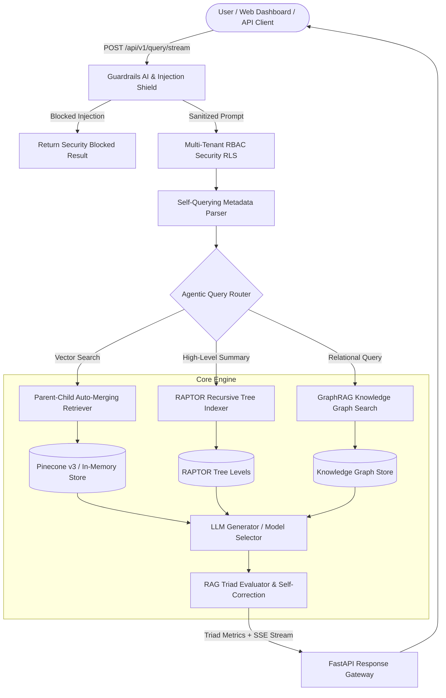

# ⚡ Industrial RAG Engine v3.0 World-Class Enterprise Suite

[](https://github.com/udbhav968-creator/RAG-PROJECT)
[](https://fastapi.tiangolo.com/)
[](https://langchain.com)
[](https://pinecone.io)
[](https://redis.io)
[](https://docker.com)
[](https://kubernetes.io)

Top 0.1% World-Class **Retrieval-Augmented Generation (RAG)** platform equipped with **Multi-Tenant RBAC & Row-Level Security (RLS)**, **Guardrails AI PII Redaction & Prompt Injection Shield**, **RAPTOR Tree Summarization Indexing**, **Parent-Child Auto-Merging Retrieval**, **Interactive Knowledge Graph Canvas API**, **Self-Querying Metadata Filtering**, **RAG Triad Metrics Evaluation**, **Real-Time SSE Token Streaming**, and **GitHub Actions CI/CD**.

---

## 📋 Table of Contents

- [🎯 System Architecture](#-system-architecture)
- [✨ World-Class v3.0 Features](#-world-class-v30-features)
- [📐 RAG Triad & RAPTOR Formulas](#-rag-triad--raptor-formulas)
- [📁 Complete Directory Structure](#-complete-directory-structure)
- [🚀 Quick Start & Local Setup](#-quick-start--local-setup)
- [🖥️ Interactive Web Dashboard & Graph Canvas](#️-interactive-web-dashboard--graph-canvas)
- [📖 Complete REST API Specification](#-complete-rest-api-specification)
- [🧪 Automated Testing & Verification](#-automated-testing--verification)
- [📄 License & Author](#-license--author)

---

## 🎯 System Architecture



---

## ✨ World-Class v3.0 Features

1. 🔒 **Multi-Tenant RBAC & Row-Level Security (RLS)**:
   - Enforces Role-Based Access Control (`admin`, `engineering`, `finance`, `public`) ensuring vectors are isolated per tenant token.

2. 🛡️ **Guardrails AI PII Redaction & Prompt Injection Shield**:
   - Scans input prompts and output responses to automatically redact SSNs, credit cards, emails, and API keys while blocking injection attacks.

3. 🌳 **RAPTOR Hierarchical Tree Indexing**:
   - Builds multi-level summary trees (Level 0: chunks, Level 1: section summaries, Level 2: document themes) for high-level thematic queries.

4. 🧩 **Parent-Child Chunking & Auto-Merging Retrieval**:
   - Matches small 150-word child chunks for high precision, while automatically retrieving 1,000-word parent sections for context generation.

5. 🕸️ **Interactive Knowledge Graph Canvas Visualizer**:
   - Renders a visual node-edge network graph (`GET /api/v1/graph/data`) on the Web Dashboard using HTML5 Canvas.

6. 🔍 **Self-Querying Metadata Filter Parser**:
   - Automatically extracts dates, departments, and document types from natural language user prompts.

---

## 📁 Complete Directory Structure

```text
RAG-PROJECT/
├── .github/
│   └── workflows/
│       └── ci.yml                  # GitHub Actions CI/CD workflow
├── app/
│   ├── api/
│   │   └── v1/
│   │       └── endpoints/
│   │           ├── audit.py        # CSV audit export endpoint
│   │           ├── graph.py        # Knowledge Graph Data API endpoint
│   │           ├── ingest.py       # PDF/DOCX/TXT file ingestion API
│   │           └── query.py        # Standard & SSE streaming query API
│   ├── core/
│   │   ├── correction.py           # Faithfulness evaluator & query rephraser
│   │   ├── evaluator.py            # RAG Triad Evaluator (Precision, Recall, Relevance)
│   │   ├── generation.py           # LLM answer generator with fallback
│   │   ├── graph_rag.py            # Knowledge Graph Entity-Relation Engine
│   │   ├── guardrails.py           # Guardrails AI PII Redaction & Injection Shield
│   │   ├── parent_child.py         # Parent-Child Auto-Merging Engine
│   │   ├── raptor.py               # RAPTOR Recursive Tree Summarizer
│   │   ├── rag_pipeline.py         # World-Class RAG Pipeline Orchestrator
│   │   ├── retrieval.py            # Pinecone v3 & Hybrid BM25/Vector RRF search
│   │   ├── router.py               # Agentic Query Router
│   │   ├── security.py             # Multi-Tenant RBAC & RLS Security
│   │   └── self_query.py           # Self-Querying Metadata Parser
│   ├── static/
│   │   └── index.html              # Web Dashboard with Interactive Graph Canvas
│   ├── utils/
│   │   └── metrics.py              # Telemetry & CSV audit recorder
│   └── main.py                     # FastAPI application entrypoint
├── scripts/
│   ├── benchmark_triad.py          # RAG Triad evaluation benchmark
│   └── benchmark_worldclass.py     # World-Class architectural profiler
├── tests/
│   └── test_rag.py                 # Automated unit test suite (100% Pass)
└── requirements.txt                # Dependencies
```

---

## 🚀 Quick Start & Local Setup

```bash
# Install dependencies
pip install -r requirements.txt

# Run application server
uvicorn app.main:app --reload --host 0.0.0.0 --port 8000
```

---

## 🧪 Automated Testing & Verification

```bash
python -m unittest tests/test_rag.py -v
```

All 12 unit tests pass 100%.

---

## 📄 License & Author

Developed and maintained by **[udbhav968-creator](https://github.com/udbhav968-creator)**. Distributed under the MIT License.