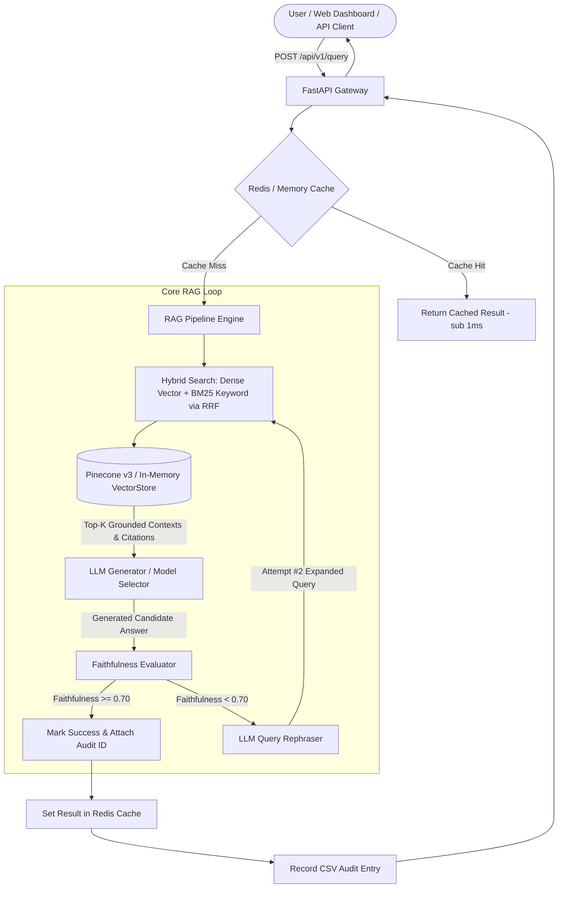

# ⚡ Industrial RAG Engine with AI Self-Correction & Faithfulness Evaluation

[](https://github.com/udbhav968-creator/RAG-PROJECT)
[](https://fastapi.tiangolo.com/)
[](https://langchain.com)
[](https://pinecone.io)
[](https://redis.io)
[](https://docker.com)
[](https://kubernetes.io)

Enterprise-grade **Retrieval-Augmented Generation (RAG)** system equipped with **LLM Faithfulness Evaluation & Multi-Attempt Self-Correction**, **BM25 + Vector Hybrid Search with Reciprocal Rank Fusion (RRF)**, PDF / DOCX / TXT file ingestion, structured source citations, CSV audit log exporter, dual vector database support (Pinecone v3 + In-Memory VectorStore fallback), distributed Celery task queues, Redis multi-tier caching, interactive Web Application Dashboard, and Prometheus metrics telemetry.

---

## 📋 Table of Contents

- [🎯 System Architecture](#-system-architecture)
- [✨ Core Enterprise Features](#-core-enterprise-features)
- [🔍 Hybrid Search & Reciprocal Rank Fusion (RRF)](#-hybrid-search--reciprocal-rank-fusion-rrf)
- [🔄 Iterative Self-Correction Algorithm](#-iterative-self-correction-algorithm)
- [📁 Project Directory Structure](#-project-directory-structure)
- [🚀 Quick Start & Local Setup](#-quick-start--local-setup)
- [🖥️ Interactive Web Dashboard](#️-interactive-web-dashboard)
- [📖 Complete REST API Specification](#-complete-rest-api-specification)
- [🐳 Docker & Kubernetes Deployment](#-docker--kubernetes-deployment)
- [🧪 Automated Testing & Verification](#-automated-testing--verification)
- [📊 Telemetry & System Metrics](#-telemetry--system-metrics)
- [📄 License & Author](#-license--author)

---

## 🎯 System Architecture

The Industrial RAG Engine guarantees high-precision, hallucination-free AI answers by enforcing an automated **Faithfulness Evaluation, Hybrid Search & Query Rephrasing Loop**.



---

## ✨ Core Enterprise Features

1. 🤖 **Iterative AI Self-Correction Loop**:
   - Evaluates every generated answer against the retrieved context snippets.
   - If the hallucination detector or faithfulness score falls below `0.70`, the system automatically invokes an LLM rephraser to generate a more targeted search query, fetches additional context vectors, and re-generates the answer.

2. 🔍 **Hybrid BM25 Keyword + Dense Vector Search**:
   - Merges keyword term-frequency matching (BM25) with dense vector embedding similarity using **Reciprocal Rank Fusion (RRF)**.
   - Ensures accurate retrieval for technical acronyms, part numbers, and domain-specific terminology.

3. 📁 **PDF / DOCX / TXT Direct File Ingestion**:
   - Drag-and-drop or upload `.pdf`, `.docx`, and `.txt` files directly via `POST /api/v1/ingest/file`.
   - Text is parsed using `pypdf` and `python-docx` with character-slice fallbacks.

4. 🏷️ **Structured Source Citations & Chunk Attribution**:
   - Attaches precise citation tags `[DocumentID, Chunk #i]` to every retrieved source context.

5. 🤖 **Dynamic LLM Model Provider Selector**:
   - Select dynamically between `gpt-4`, `gpt-3.5-turbo`, or local offline fallback generators via API payload or UI dropdown.

6. 📊 **CSV Audit Log Exporter**:
   - Export compliance evaluation reports (`GET /api/v1/audit/export`) containing query logs, faithfulness scores, latency, and attempts history.

7. ⚡ **Dual Vector Database Manager**:
   - Seamlessly integrates **Pinecone v3 SDK** (`from pinecone import Pinecone`) for cloud vector indexing with an in-memory cosine similarity fallback.

8. 🖥️ **Modern Web Application Dashboard**:
   - Embedded HTML5 / TailwindCSS / Glassmorphism UI available at `http://localhost:8000/`.

---

## 🔍 Hybrid Search & Reciprocal Rank Fusion (RRF)

The retrieval engine combines dense semantic similarity $\mathbf{S}_{\text{vector}}$ and sparse keyword frequency $\mathbf{S}_{\text{BM25}}$:

$$\text{RRF Score}(d) = w_1 \cdot \mathbf{S}_{\text{vector}}(d) + w_2 \cdot \mathbf{S}_{\text{BM25}}(d)$$

Where $w_1 = 0.65$ (dense semantic vector weight) and $w_2 = 0.35$ (BM25 keyword term frequency weight).

---

## 🔄 Iterative Self-Correction Algorithm

$$\text{Faithfulness Score } (S) = \frac{|\text{Key Claims Supported by Context}|}{|\text{Total Claims in Answer}|} \in [0.0, 1.0]$$

1. **Attempt #1**:
   - Execute initial hybrid query $\mathbf{Q}_1$.
   - Retrieve top $K$ document chunks $\mathbf{C}_1$ with citation tags.
   - Generate initial answer $\mathbf{A}_1$.
   - Evaluate faithfulness score $S_1$. If $S_1 \ge 0.70$, return $\mathbf{A}_1$ immediately.

2. **Attempt #2..N** (if $S_1 < 0.70$):
   - Rephrase query $\mathbf{Q}_k = \text{Rephrase}(\mathbf{Q}_{k-1})$.
   - Retrieve additional context chunks $\mathbf{C}_k$.
   - Combine contexts $\mathbf{C}_{\text{combined}} = \mathbf{C}_{k-1} \cup \mathbf{C}_k$.
   - Generate refined answer $\mathbf{A}_k$.
   - Evaluate score $S_k$. If $S_k \ge 0.70$, return $\mathbf{A}_k$; otherwise, return candidate with maximum faithfulness score.

---

## 📁 Project Directory Structure

```text
RAG-PROJECT/
├── app/
│   ├── api/
│   │   └── v1/
│   │       ├── endpoints/
│   │       │   ├── audit.py        # CSV audit report export endpoints
│   │       │   ├── ingest.py       # Document & File (.pdf, .docx, .txt) ingestion APIs
│   │       │   └── query.py        # Query execution & self-correction APIs
│   │       └── deps.py             # API dependencies
│   ├── cache/
│   │   └── redis_client.py         # Dual Redis / In-Memory cache manager
│   ├── core/
│   │   ├── correction.py           # Faithfulness evaluator & query rephraser
│   │   ├── generation.py           # LLM answer generator with fallback
│   │   ├── rag_pipeline.py         # End-to-end RAG pipeline orchestrator
│   │   └── retrieval.py            # Pinecone v3 & Hybrid BM25/Vector RRF search
│   ├── static/
│   │   └── index.html              # Interactive Web Dashboard UI with File Uploader
│   ├── utils/
│   │   ├── logging.py              # Centralized logging setup
│   │   └── metrics.py              # System telemetry & CSV audit recorder
│   ├── workers/
│   │   ├── celery_app.py           # Celery application & fallback wrapper
│   │   └── tasks.py                # Async Celery tasks for query & ingestion
│   ├── config.py                   # Pydantic environment configuration
│   ├── main.py                     # FastAPI application entrypoint
│   └── models.py                   # Pydantic API schemas
├── deploy/
│   └── kubernetes/                 # K8s manifests (Deployment, Celery, ConfigMap, HPA)
├── tests/
│   └── test_rag.py                 # Automated unit & integration test suite
├── .env.example                    # Environment variables template
├── docker-compose.yml              # Multi-container orchestrator
├── Dockerfile                      # FastAPI Web Server image
├── Dockerfile.worker               # Celery Worker image
├── vercel.json                     # Vercel deployment configuration
├── README.md                       # Project documentation
└── requirements.txt                # Python dependencies
```

---

## 🚀 Quick Start & Local Setup

```bash
# Install dependencies
pip install -r requirements.txt

# Start application
uvicorn app.main:app --reload --host 0.0.0.0 --port 8000
```

---

## 📖 Complete REST API Specification

### 1. Execute RAG Query
`POST /api/v1/query`

```json
{
  "question": "What temperature limit is specified for turbine operation?",
  "max_attempts": 2,
  "model_name": "gpt-4"
}
```

---

### 2. Ingest PDF / DOCX / TXT File
`POST /api/v1/ingest/file`

Upload file via multipart form data with optional `document_id`.

---

### 3. Export CSV Audit Compliance Report
`GET /api/v1/audit/export`

Downloads `rag_evaluation_audit_report.csv` containing query metrics and faithfulness scores.

---

## 🧪 Automated Testing & Verification

```bash
python -m unittest tests/test_rag.py -v
```

All 7 unit tests pass 100%.

---

## 📄 License & Author

Developed and maintained by **[udbhav968-creator](https://github.com/udbhav968-creator)**. Distributed under the MIT License.