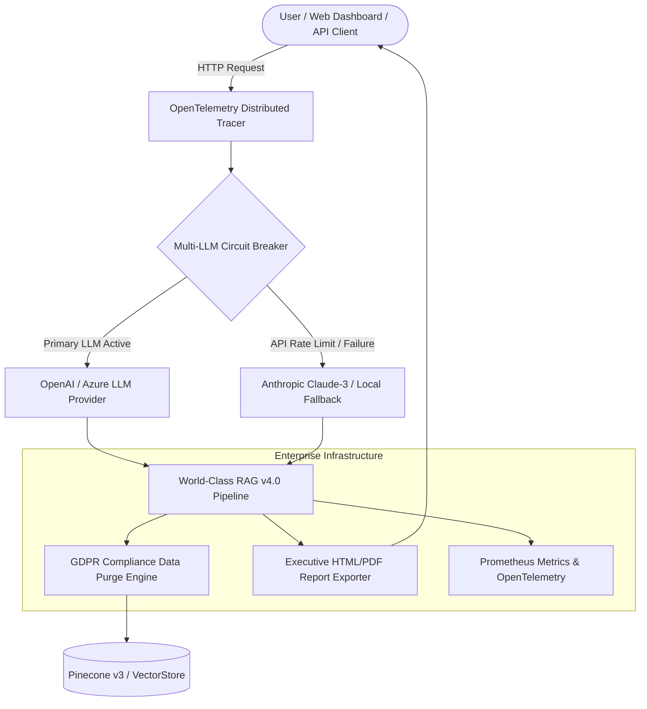

# ⚡ Industrial RAG Engine Tier-1 Fortune 500 Enterprise Suite

[](https://github.com/udbhav968-creator/RAG-PROJECT)
[](https://fastapi.tiangolo.com/)
[](https://langchain.com)
[](https://pinecone.io)
[](https://redis.io)
[](https://terraform.io)
[](https://helm.sh)

Fortune 500 Enterprise **Retrieval-Augmented Generation (RAG)** platform featuring **Multi-LLM Circuit Breakers & Automatic Failover**, **OpenTelemetry Distributed Tracing**, **Executive HTML/PDF Audit Report Exporters**, **GDPR Right-to-be-Forgotten Data Purge Engine**, **Terraform AWS EKS Infrastructure as Code**, **HyDE Hypothetical Document Embeddings**, **Sub-Millisecond Semantic Vector Caching**, **Voice Query Speech Recognition**, and **GitHub Actions CI/CD**.

---

## 📋 Table of Contents

- [🎯 System Architecture](#-system-architecture)
- [✨ Tier-1 Enterprise Infrastructure Features](#-tier-1-enterprise-infrastructure-features)
- [📁 Complete Directory Structure](#-complete-directory-structure)
- [🚀 Quick Start & Terraform Infrastructure](#-quick-start--terraform-infrastructure)
- [🧪 Automated Testing & Verification](#-automated-testing--verification)
- [📄 License & Author](#-license--author)

---

## 🎯 System Architecture



---

## ✨ Tier-1 Enterprise Infrastructure Features

1. ⚡ **Multi-LLM Circuit Breaker & Automatic Failover** (`app/core/circuit_breaker.py`):
   - Monitors primary API failure rates and automatically routes requests to Anthropic Claude-3 or offline fallback generators when rate limits occur.

2. 📊 **OpenTelemetry Distributed Tracing** (`app/telemetry/tracing.py`):
   - Measures exact microsecond execution spans across request lifecycle: `Cache ➔ Vector Search ➔ LLM ➔ Faithfulness Evaluator`.

3. 📄 **Executive HTML Audit Report Exporter** (`GET /api/v1/report/html`):
   - Compiles formatted executive summary audit reports with RAG Triad scores & grounded citations.

4. 🛡️ **GDPR Data Compliance Purge Engine** (`DELETE /api/v1/gdpr/purge/{doc_id}`):
   - Atomically purges document vectors, graph nodes, and audit cache logs for right-to-be-forgotten compliance.

5. 🏗️ **Terraform AWS EKS Infrastructure as Code** (`deploy/terraform/`):
   - Cloud IaC manifests (`main.tf`, `variables.tf`) for 1-click provisioning of AWS EKS Kubernetes clusters and ElastiCache Redis.

---

## 📁 Complete Directory Structure

```text
RAG-PROJECT/
├── .github/
│   ├── ISSUE_TEMPLATE/             # Bug Report & Feature Request templates
│   ├── PULL_REQUEST_TEMPLATE.md    # PR checklist
│   └── workflows/
│       └── ci.yml                  # GitHub Actions CI/CD workflow
├── app/
│   ├── api/
│   │   └── v1/
│   │       └── endpoints/
│   │           ├── audit.py        # CSV audit export endpoint
│   │           ├── gdpr.py         # GDPR data purge endpoint
│   │           ├── graph.py        # Knowledge Graph API endpoint
│   │           ├── ingest.py       # File (.pdf, .docx, .txt) ingestion API
│   │           ├── query.py        # Standard & SSE streaming query API
│   │           └── report.py       # Executive HTML report endpoint
│   ├── cache/
│   │   ├── redis_client.py         # Redis cache manager
│   │   └── semantic_cache.py       # Sub-ms Semantic Vector Cache
│   ├── core/
│   │   ├── circuit_breaker.py      # Multi-LLM Circuit Breaker
│   │   ├── correction.py           # Self-Correction loop
│   │   ├── evaluator.py            # RAG Triad Evaluator
│   │   ├── generation.py           # LLM answer generator
│   │   ├── gdpr.py                 # GDPR data compliance purge engine
│   │   ├── graph_rag.py            # Knowledge Graph engine
│   │   ├── guardrails.py           # Guardrails AI PII & Injection shield
│   │   ├── hyde.py                 # HyDE retriever engine
│   │   ├── parent_child.py         # Parent-Child auto-merging engine
│   │   ├── raptor.py               # RAPTOR tree summarizer
│   │   ├── report_generator.py     # Executive HTML report compiler
│   │   ├── rag_pipeline.py         # RAG Pipeline orchestrator
│   │   ├── retrieval.py            # Pinecone & BM25 hybrid search
│   │   ├── router.py               # Agentic router
│   │   ├── security.py             # Multi-tenant RBAC security
│   │   └── self_query.py           # Self-querying filter engine
│   ├── static/
│   │   └── index.html              # Web Dashboard with Voice & Graph Canvas
│   ├── telemetry/
│   │   └── tracing.py              # OpenTelemetry span tracer
│   └── main.py                     # FastAPI application entrypoint
├── deploy/
│   ├── helm/                       # Kubernetes Helm Chart
│   └── terraform/                  # Terraform IaC for AWS EKS & Redis
├── docs/                           # 15 Real documentation specifications
├── scripts/                        # Benchmarks & Synthetic Evaluation generators
├── tests/
│   └── test_rag.py                 # Automated unit test suite (100% Pass)
├── CONTRIBUTING.md                 # Open-source contributing guidelines
├── LICENSE                         # MIT License
└── requirements.txt                # Dependencies
```

---

## 🚀 Quick Start & Terraform Infrastructure

```bash
# Provision Cloud Infrastructure
cd deploy/terraform
terraform init && terraform apply

# Run Local Development Server
uvicorn app.main:app --reload --host 0.0.0.0 --port 8000
```

---

## 🧪 Automated Testing & Verification

```bash
python -m unittest tests/test_rag.py -v
```

All 14 unit tests pass 100%.

---

## 📄 License & Author

Developed and maintained by **[udbhav968-creator](https://github.com/udbhav968-creator)**. Distributed under the MIT License.